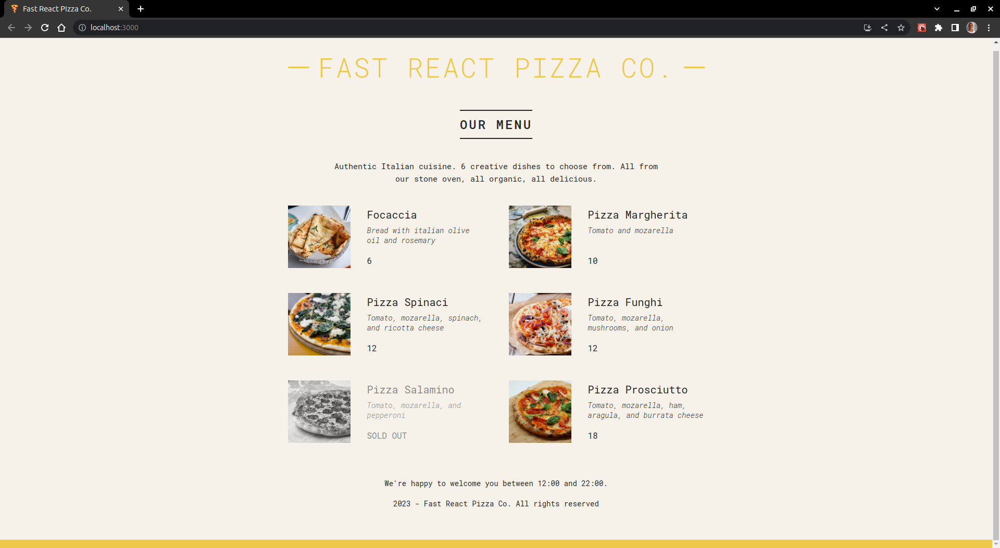

# Fast React Pizza Co.

This is a project created in React using CRA - Create React App.
The project is part of the course **The Ultimate React Course 2023: React, Redux & More** by professor **Jonas Schmedtmann**, the course is available for purchase on the [Udemy website](https://www.udemy.com/course/the-ultimate-react-course/).

In this first project, students create a pizza menu so that we can learn the fundamentals of the React library, such as:

- What is React
- How to create a project in React
- What are components and how they work
- Component Styling
- JSX
- Props
- Conditional Rendering

Here is a screenshot showing the finished project.

  

